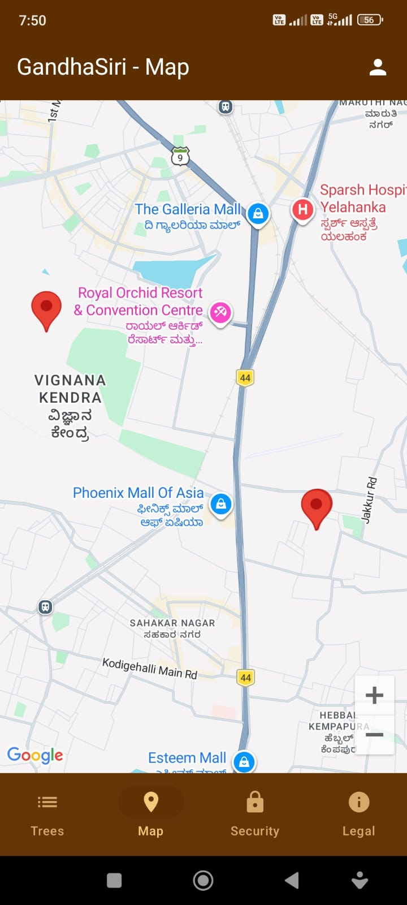
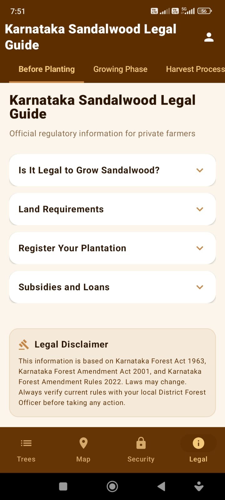
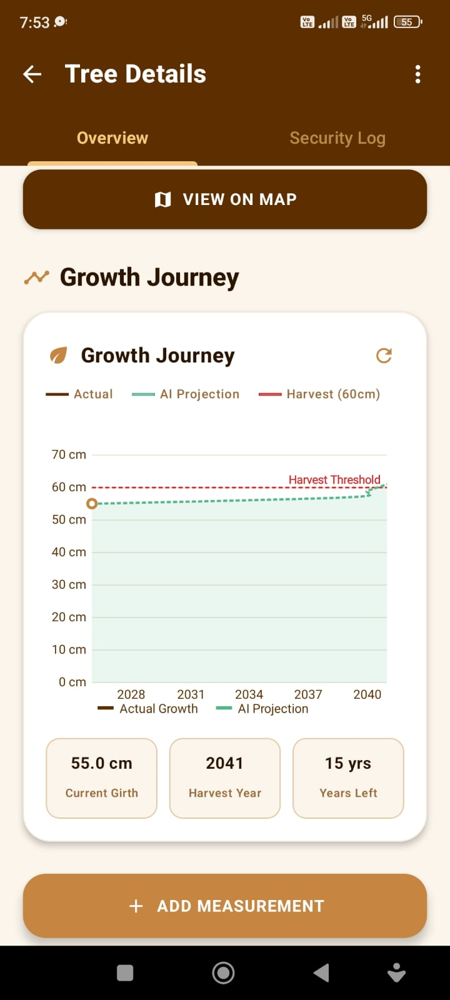
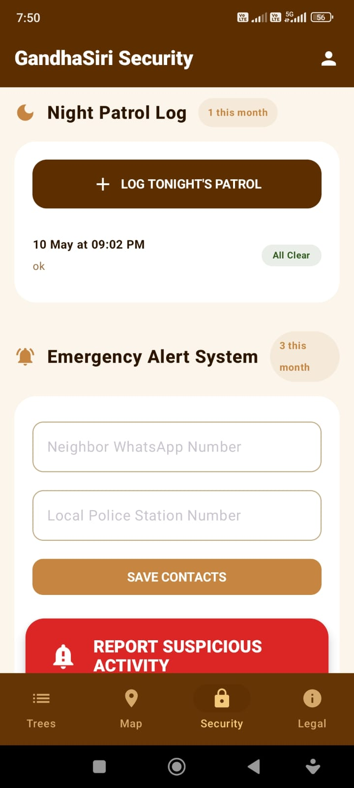
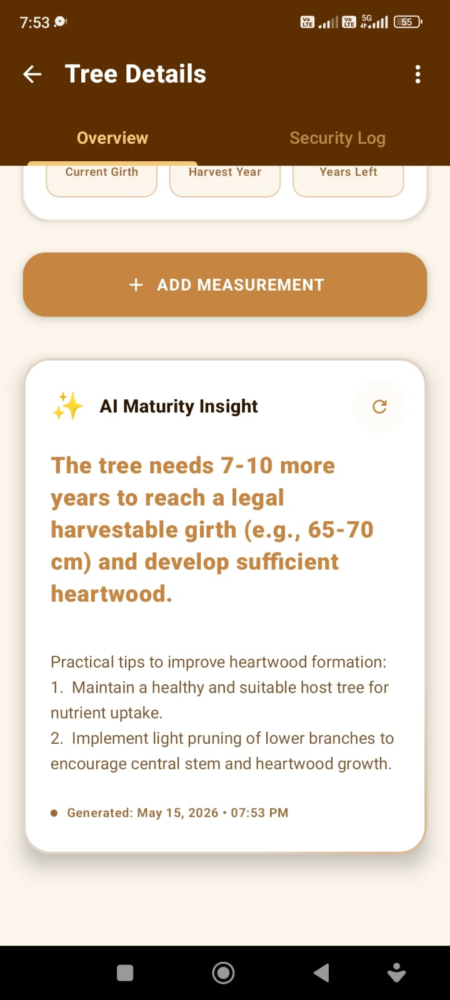

# GandhaSiri 🌳

GandhaSiri is a modern, high-security Android application designed for the comprehensive management and protection of sandalwood plantations. Built with Jetpack Compose and powered by Google Gemini AI, it offers an "offline-first" experience for farmers and plantation managers.

## 📥 Download

[](https://drive.google.com/file/d/1PoDs9XU7nKvPav-zKMM5e9i3926Cq2Tb/view)

*You can download and install the latest version of the app directly from the link above.*


## ✨ Key Features

- **🌲 Smart Tree Registration:** Easily register new trees with precise GPS coordinates, age, and initial girth measurements.
- **🛡️ Advanced Security:** 
    - **Panic Button:** Instant emergency alerts with real-time GPS location.
    - **Patrol Logging:** Track security rounds and suspicious activity reports.
    - **Secure Access:** PIN-based login system to protect sensitive plantation data.
- **🤖 AI-Powered Insights:**
    - **Growth Estimation:** Uses Google Gemini AI to predict future growth and harvest readiness based on historical data.
    - **Security Assessment:** AI-driven analysis of suspicious activity logs.
- **🌍 Multi-Language Support:** Localized for a regional audience with support for:
    - Kannada (ಕನ್ನಡ)
    - Hindi (हिन्दी)
    - Telugu (తెలుగు)
    - Tamil (தமிழ்)
    - Malayalam (മലയാളം)
    - English
- **📊 Interactive Growth Charts:** Visualize the projected growth of each tree over its lifetime.
- **📍 Integrated Mapping:** View all registered trees on a high-precision map for easy navigation.

## 🛠️ Tech Stack

- **UI Framework:** Jetpack Compose (Modern Declarative UI)
- **Language:** Kotlin
- **Database:** Room (Offline-first data persistence)
- **AI Integration:** Google Generative AI (Gemini Pro/Flash)
- **Networking:** Retrofit & Coil
- **Navigation:** Jetpack Navigation Compose
- **Architecture:** MVVM (Model-View-ViewModel)

## 🚀 Getting Started

### Prerequisites
- Android Studio Ladybug or later.
- A Google Gemini API Key (get it from [Google AI Studio](https://aistudio.google.com/)).
- A Google Maps API Key.

### Installation
1. Clone the repository:
   ```bash
   git clone https://github.com/Nandishreddy2903/GandhaSiri.git
   ```
2. **🔐 Configure Secrets:**
   Create a `local.properties` file in the root directory. This file is excluded from version control for security. Add your personal API keys as follows:
   ```properties
   GEMINI_API_KEY=your_gemini_api_key
   MAPS_API_KEY=your_google_maps_api_key
   ```
3. Build and run the project on your Android device or emulator.

## 📱 Screenshots

<p align="center">
  
  
  
</p>
<p align="center">
  
  
  
</p>

## 📄 License
This project is for internship purposes. All rights reserved.

---
